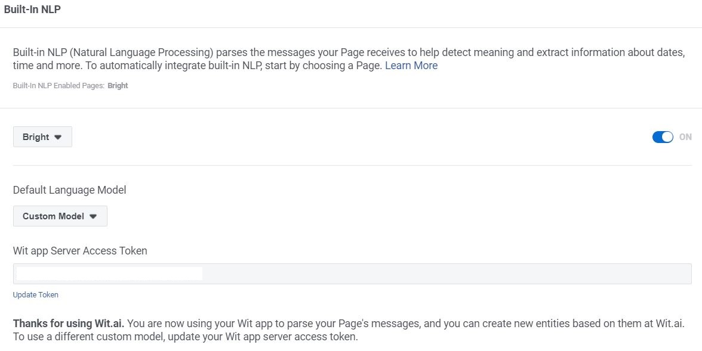
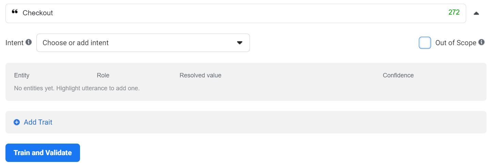
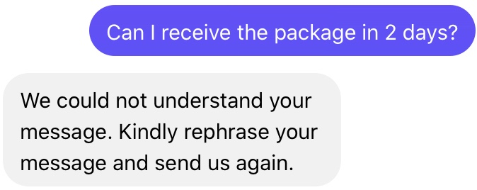
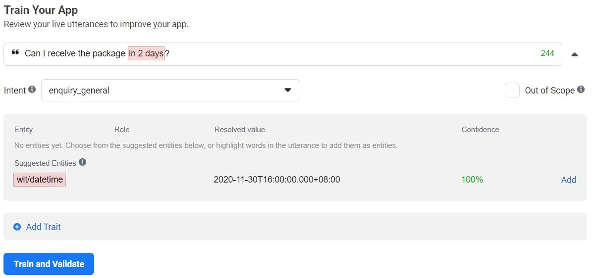
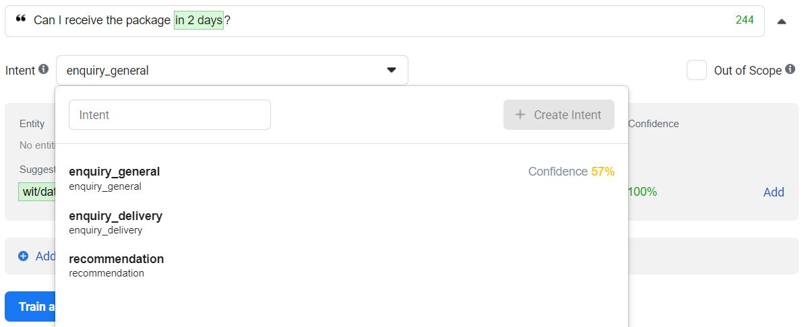
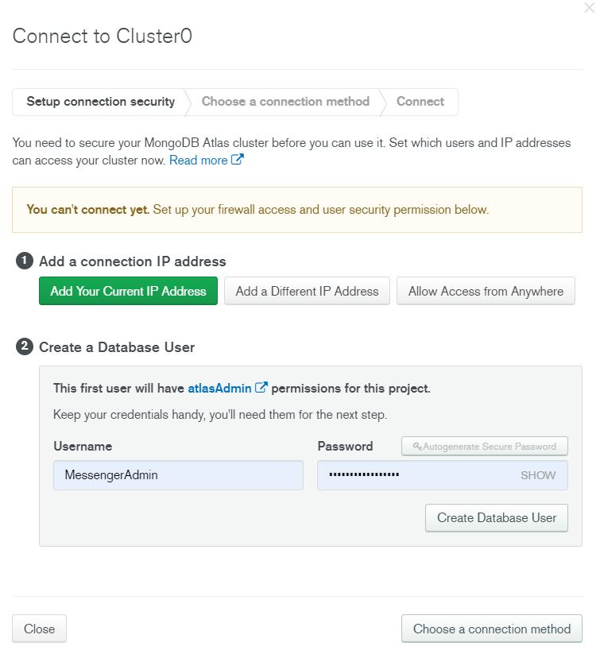
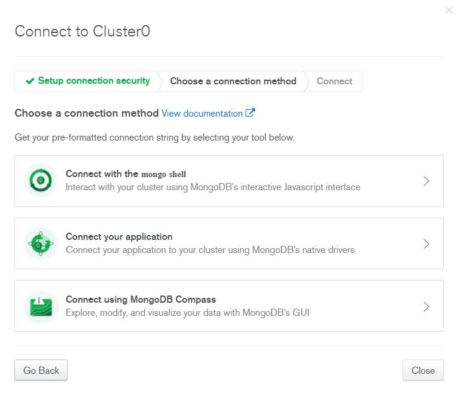
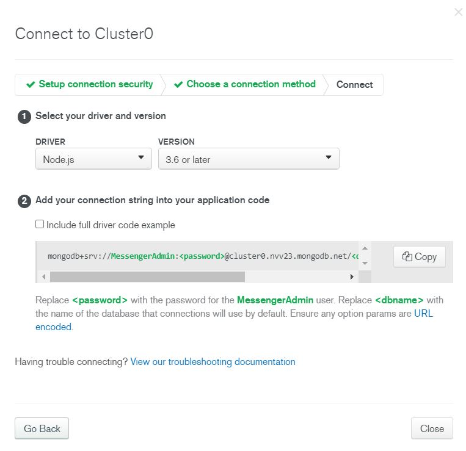
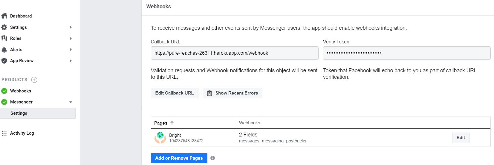
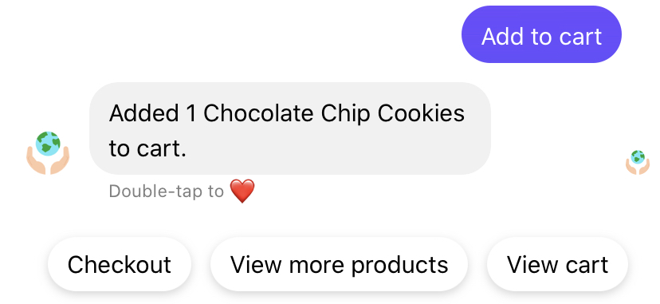

# Create Smarter Messenger Experiences on Facebook with Bright Commerce Chatbot

## Introduction

Chatbots today are the face of customer services across many businesses as it is a form of automation that allows them to free up manpower for other operations. NGOs can greatly benefit through these areas and our team felt that it is possible to help alleviate their lack of manpower through this technology.

Also, during this period, many of us find ourselves browsing online stores to purchase our daily necessities. Therefore, chatbots have also found themselves relevant in this trend to create immersive chat experiences in online commerce businesses. Some users will want to have human-like interactions in their shopping experiences - and that is enabled through the use of a chatbot.

We felt that this use case would be a good example to showcase the functionalities of a Messenger chatbot and introduce budding chatbot developers to learn how to get started on their own messaging commerce platforms using their Facebook Pages and `Wit.ai`.

## Pre-Requisites

The following subsections list the background knowledge and how to get started prior to creating a chatbot.

### JavaScript Knowledge

Basic Javascript knowledge on objects, conditional statements, and functions will be helpful in the implementation of Bright chatbot. Specific knowledge on Node.js is also used in this tutorial which acts as the server to handle communications between Bright and Facebook.

Browse the following resources below to learn more about the technologies used:
- JavaScript:  https://javascript.info/
- Basic Node.js: https://www.w3schools.com/nodejs/

### Git Knowledge

Git is a version control system that will be mainly used to update code used to build the chatbot. More information on Git can be found on https://git-scm.com/

We recommend versioning your code on a GitHub repository.

### Facebook Page
Creating a Facebook Page is a key step in your journey to creating a Messenger experience. Here are a few simple steps to help you get started:

1. Go to https://www.facebook.com/pages/create - it should lead you to a page shown below


2. Fill in your page information
3. Add images - adding a profile and cover image is important to allow others to identify your business

Congratulations! You have done the setup of your Facebook Business Page! Next is on how to create a Messenger Bot for your page!

### Optional: Add a “Send Message” Button
After creating your very own Facebook Page for your business, you will want a way to communicate with your customers. Before even going into the details on how to create a chatbot, what better way than to direct users to send messages to you when they visit your page?

This button should be found at the top of your page. Click on **Add a Button** and select the **Send Message** option.


### Optional: Create a Greeting

Customize your personal message to your customers when they first start communicating with your page through Messenger. So how do we go about doing it?

1. Go to your page’s General Settings and select **Messaging**
2. Scroll down and turn on **Show a greeting**
3. Customise your greeting and click **Change**

### Optional: Create Frequently Asked Questions and Responses

Create a set of creative responses for frequently asked questions regarding your business. This is highly recommended before creating your chatbot as it helps you brainstorm and implement various prompts for users to start interacting with your page on Messenger.

Here is how you can do it:

1. Under Manage Page, select **Inbox**
2. In the left menu sidebar, select **Automated Responses**
3. Enable **Frequently Asked Questions**
4. Click **Edit**
5. Add questions and responses (remember to save your responses with the **Save** button on the top right!)

### Connect your Webhook onto your Facebook for Developers App

These are the important few steps to getting started before you can develop your chatbot to serve your users using code.

#### Create an App on Facebook for Developers

1. Head to https://developers.facebook.com, click on **My Apps**
2. Click on **Create App**, located on the top right of the screen
3. Select **Manage Business Integration**
4. Enter your **App Display Name** and **App Purpose**
5. After creating the app, on the side bar, click on add products, leading you to the **Add Products** section on the main page. Find the **Messenger** product and click **Set Up**

Next, the following steps will be detailed in the next two sections. To summarise:

6. You will have to generate a page access token by adding a new page to the Messenger product, after clicking on the **Add or Remove Pages** button, select your Facebook page that you would like to add. After adding the page, you will be able to see a **Generate Token** button, which will give you a page access token that will be used on your Node.js for communication with Facebook via the Send API.
7. Set up a callback URL by entering your callback URL (location where your Node.js server is hosted) and also enter the verify token (which is a random string) that is determined by you in the Node.js server during the Node.js server setup. Lastly, click on **Verify and Save** to confirm your callback URL.
8. Now you’re ready to test the app, go to Messenger, and type a message to your Page. If your Node.js server (with the callback URL) receives a webhook event, you’ve successfully set up your app to receive messages!

#### Create the Webhook

Webhooks are API endpoints which you expose, to allow client(s) to connect to. This allows the users to interact to either send data or collect data from your servers. In this case, we are using this endpoint as an interaction between your webhook and your Facebook for Developers App, to send and receive data from our chatbot on your Facebook business page. 

1. Create a directory (folder), and navigate into it via the command line
2. Next, create an empty, `index.js` file in your project folder
3. Issue the command, `npm init` on the command line, accept default for all questions, and this will create `package.json` in your project folder automatically.
4. Issue the command, `npm install express body-parser --save`, this installs the Express.js http server framework module, and add them as dependencies in your `package.json` file
5. Create a server that listens for communication at the default port by adding the following code below into your `index.js` file

```js
'use strict';
 
// Imports dependencies and set up http server
const
  express = require('express'),
  bodyParser = require('body-parser'),
  app = express().use(bodyParser.json()), // creates express http server
  dotenv = require('dotenv');

dotenv.config();
 
// Sets server port and logs message on success
const listener = app.listen(process.env.PORT || 1337, () => console.log('webhook is listening on port ' + listener.address().port));
 
app.get('/', (req, res) => {
  res.status(200).send('You are connected to the chatbot application.');
})
```

6. Let us now create a `GET` request `/webhook` endpoint for your Facebook for Developers App to verify the webhook. We suggest adding your verification token in a `.env` file.

```js
// Adds support for GET requests to our webhook
app.get('/webhook', (req, res) => {
  
  // Your verify token. Should be a string you set.
  let VERIFY_TOKEN = process.env.VERIFY_TOKEN;
  
  // Parse the query params
  let mode = req.query['hub.mode'];
  let token = req.query['hub.verify_token'];
  let challenge = req.query['hub.challenge'];
  
  // Checks if a token and mode is in the query string of the request
  if (mode && token) {
    
    // Checks the mode and token sent is correct
    if (mode === 'subscribe' && token === VERIFY_TOKEN) {
      
      // Responds with the challenge token from the request
      console.log('WEBHOOK_VERIFIED');
      res.status(200).send(challenge);
      
    } else {
      // Responds with '403 Forbidden' if verify tokens do not match
      res.sendStatus(403);      
    }
  }
});
```

7. Finally, you can now test your webhook by issuing the curl command (replace the `<VERIFY_TOKEN>` with your own token that you had specified in the previous step:

```sh
curl -X GET "localhost:1337/webhook?hub.verify_token=<VERIFY_TOKEN>&hub.challenge=CHALLENGE_ACCEPTED&hub.mode=subscribe"
```

#### Hosting on Heroku

As the chatbot's callback URL requires a HTTPS endpoint, we recommend hosting the chatbot on Heroku. The guide on how to deploy can be found at https://devcenter.heroku.com/articles/getting-started-with-nodejs?singlepage=true

Next, to connect to a Git repository, you can utilise the GitHub integration in Heroku, which allows for automatic deployment whenever your `main` branch is updated https://devcenter.heroku.com/articles/github-integration

#### Link the Webhook with your Facebook for Developers App

So how can you connect with Facebook? 

1. Go to your Application that you have created earlier in https://developers.facebook.com
2. Select **Messenger** and click **Settings**
3. Insert your server’s **Callback URL**, followed by `/webhook`. In this tutorial the webhook endpoint is `https://<url>/webhook`. Note here that the URL has to be served with HTTPS, or else you would not be able to connect to Facebook

Note that the verify token is like a shared secret that Facebook has between you and your application for them to authenticate the connection to the callback URL. 

This is how it looks like if you have successfully added the webhook callback URL:


There you have it, you have successfully connected your chatbot application with Facebook!

## Sending and Receiving Messages

Sending messages require the use of Send API via a post request coupled with your page access token included in your URL query string.

Below is a wrapper function that takes in the sender’s identifier (called Page-scoped ID, or PSID in short) and the response object. This function converts parameters into the standardised data structure and proceeds to send the response.

```js
// Sends response messages via the Send API
function callSendAPI(sender_psid, response) {
 
  // Construct the message body
  let request_body = {
      messaging_type: 'RESPONSE',
      recipient: {
          id: sender_psid
      },
      message: response
  };
 
  // Send the HTTP request to the Messenger Platform
  request(
      {
        uri: "https://graph.facebook.com/v8.0/me/messages",
        qs: { access_token: process.env.PAGE_ACCESS_TOKEN },
        method: "POST",
        json: request_body
      },
      (err, res, body) => {
          if (!err) {
              console.log("Message sent!");
          } else {
              console.error("Unable to send message: " + err);
          }
      }
  );
}
```

In the `request_body`, the recipient’s ID is the sender of the messenger, which can be referenced by the PSID. This allows us to specify which user the message response is for, and for the Messenger Platform to route to the right user. The message attribute in the request_body simply refers to the response of the message that you will like to send back.

In order to make a HTTP request to the Messenger Platform, we will use the request package. More information on that package can be found here: https://www.npmjs.com/package/request.

The request object takes in 
- `uri`: The URI of the Send API
- `qs`: Query string parameters that will be attached to the URL
- `PAGE_ACCESS_TOKEN`
- `json`: Request body JSON that you had created

To get the `PAGE_ACCESS_TOKEN`, navigate to your App on Facebook for Developers. Under **Access Tokens**, click **Add or Remove Pages**. Add your page and click **Generate Token**. Read and check **I Understand**, then create a `.env` file and paste the token.

Your `.env` file should now look like this:
```
PAGE_ACCESS_TOKEN=<page_access_token>
VERIFY_TOKEN=<verify_token>
```

Create a `.gitignore` and add `.env` inside (if you have not). Also, [add the variables to Heroku](https://devcenter.heroku.com/articles/config-vars).  In our script, we the `dotenv` package is used to configure and retrieve the page access token. 

The start of your `index.js` should look like this (remember to add the new dependencies in `package.json` too):

```js
// Imports dependencies and set up http server
const
  express = require('express'),
  bodyParser = require('body-parser'),
  app = express().use(bodyParser.json()), // creates express http server
  dotenv = require('dotenv'),
  request = require('request');
 
dotenv.config();
```

Once all these components are in place, you’re ready to execute standard responses back to the sender. Let us try automating some standard responses!

We first define a wrapper function `sendMessage` that takes in `sender_psid` and `message` (of string type), converts the string to a response object, then sends the message. This function might seem unnecessary now, but is definitely useful when the scale of the chatbot gets larger.

```js
// Wrapper method to convert text message string to response object, and sends the message
function getResponseFromMessage(message) {
  const response = {
      text: message
  };

  return response;
}
```

### Receiving and Sending Back the Same Message
We will first start by responding to the same message as what the user sent.

```js
// Creates the endpoint for our webhook 
app.post('/webhook', (req, res) => {  
  
  let body = req.body;
  
  // Checks this is an event from a page subscription
  if (body.object === 'page') {
    
    // Iterates over each entry - there may be multiple if batched
    body.entry.forEach(function(entry) {
      
      // Gets the message. entry.messaging is an array, but 
      // will only ever contain one message, so we get index 0
      let webhook_event = entry.messaging[0];
      let sender_psid = webhook_event['sender']['id'];
      let message = webhook_event['message']['text'];
      console.log('Message received from sender ' + sender_psid + ' : ' + message);
      
      let response = getResponseFromMessage(message);
      callSendAPI(sender_psid, response);
    });
    
    // Returns a '200 OK' response to all requests
    res.status(200).send('EVENT_RECEIVED');
  } else {
    // Returns a '404 Not Found' if event is not from a page subscription
    res.sendStatus(404);
  }
  
});
```

Try it out! You should see the following behaviour:


### Sending Standard Responses

Now let us implement some standard reponses. First, replace `sendMessage` with a new `processMessage` function that will be implemented.

The `processMessage` function encapsulates the implementation of the standard responses.

```js
function processMessage(message) {
  
  message = message.toLowerCase();

  let responses = {
    hi: "Hi there! Welcome to Bright. How can I help you?",
    bright: "Bright is a social enterprise where we provide vocational training to adults with intellectual disabilities.\n\n" +
        "We started a range of social enterprise projects to provide alternative work engagement opportunities for our adult trainees. " + 
        "Some of the projects began as therapy programmes which encourage the development of fine motor skills; others provide a realistic vocational training environment.\n\n" +
        "All net revenue earned from the sale of our products and services go towards paying a monthly allowance for our clients' work, as well as their lunch expenses while undergoing training.",
    proceeds:
        "All net revenue earned from the sale of our products and services go towards paying a monthly allowance for our clients' work, as well as their lunch expenses while undergoing training.",
    support:
        "We support adults with intellectual disabilities. We started a range of social enterprise projects to provide alternative work engagement for our adult trainees.",
    sell: "We sell craft and baker goods.\nLike our Facebook page http://fb.me/brightsocialsg to stay updated!",
    safe: "Our cookies are made by our clients in a clean and sanitised environment. The cookies are safe to consume before the expiry date that is printed on the packaging."
  };

  for (const key in responses) {
    if (message.includes(key)) {
      return getResponseFromMessage(responses[key]);
      break;
    }
  }

  // Message does not match any keyword, send default response
  return getResponseFromMessage("We could not understand your message. Kindly rephrase your message and send us again.");

}
```

Now, whenever your message includes any of those keywords in the `responses` object, a standard response message will be sent.

## Introduction to `Wit.ai` Natural Language Processing (NLP)

`Wit.ai` is a NLP service that provides a user-friendly interface to facilitate training your Facebook Messenger chatbot. Using its own NLP engine, `Wit.ai` is essentially used to build the “brain” of Bright chatbot.

### Creating a Customised `Wit.ai` Application

Sign in to `Wit.ai` using Facebook and click on **New App**. 


Let's name our application **BrightChatbot** and make its visibility **Private**. Click on **Create**. 


Congratulations, you’ve now made your first `Wit.ai` application. 

### Connecting the Custom `Wit.ai` NLP Model to your Facebook for Developers App

We will now connect the NLP model to your Facebook for Developers application.  This is done by going to your Facebook for Developers application’s Messenger Settings page and toggling the built-in NLP option for your page under the **Built-In NLP** section.


Although Messenger comes with a default NLP engine with `Wit.ai`, we are training our own custom NLP model on `Wit.ai`. 

To connect your `Wit.ai` model to your Facebook for Developers application, you will first need to generate a **Server Access Token**. Generating your Server Access Token is simple. In `Wit.ai`, click on the **Settings** on the left tab (under **Management**). 


Under **Server Access Token**, click **Generate New Token** and your access token will be generated.


Copy the Access Token and head over to the Facebook for Developers application's **Messenger Settings** page. Then, under **Built-In NLP**, click on the dropdown for **Default Language Model** and select **Custom Model**. Paste the server access token into the textbox field.



Congratulations, your `Wit.ai` NLP model has been successfully connected to your Facebook chatbot application!

We will now spending some time training our `Wit.ai` model to understand our custom intents and entities for our use case, to make our chatbot more capable of handling the messages it may face.

### Example of a Built-in Trait

Back to the `Wit.ai` model, you will see three tabs titled **Understanding**, **Management** and **Insights** on the left. Let’s start by training our chatbot on the **Understanding** tab.


Click the **Understanding** tab.  A sentence, such as a question to the chatbot, is known as an **utterance**. The intention behind this utterance is quite simply, the **intent**. 

`Wit.ai` has built-in entities that can be readily used for a number of common conversation topics. We often start off a conversation with a greeting and `Wit.ai` has a corresponding trait called `wit/greetings`. Traits are used to capture intents from the whole utterance.
Our `Wit.ai` application is pre-trained to identify a number common greetings. Whether you type “hello”, “hi” or even “aloha” in the Utterance section, the trait will be identified as `wit/greetings`.


### Training the Model to Understand the Intent of a Message

Let’s train the chatbot to understand a generic question seeking a product recommendation.

In the **Utterance** tab, type the utterance “I want to buy something”. Click the **Choose or add intent** drop-down list and create new intent **recommendation**.


Click **Train and Validate**.
- You will see **Training scheduled** followed by **Training ongoing** on the top right-hand corner as `Wit.ai` trains to identify the recommendation intent from your sentence
- **Training complete** is shown when the training is finished


During the training process, there is no need to wait for the previous utterance’s training to complete before training new utterances. You can keep training new utterances back-to-back as the training process for each utterance can run in parallel on `Wit.ai`.

### Training the Model to Understand the Entity in a Message

What if instead of a general recommendation, the buyer wants to specifically buy a type of product such as cookies? We classify **cookies** as `baker` type products and would need the chatbot to recognise **cookies** as the **product_type** entity.

Set utterance as “What types of cookies do you have?”
The intent is `recommendation` by default as that’s the only intent we have trained so far.

To identify the intent, highlight "cookies":


Create the entity **product_type**. The entity is now shown prior to training. For more complicated sentences with multiple entities, you can highlight and label them one by one.

Change the **Resolved value** to `baker` as we want the cookies to be identified as being in the baker category.


Now **Train and Validate**. The chatbot’s learning is not limited to only the utterances shared through **Understand**. The model itself will be able to infer additional ways the same question or utterance can be asked based on the few examples provided by you. 

### Adding more Training Data

Let’s train the chatbot to understand more utterances and intents to help it better understand future queries. Train it with the following:

| Utterance | Intent |
| --- | --- |
| How do I know if they are safe to consume? | `enquiry_general` |
| I need help | `enquiry_general` |
| When is delivery coming? | `enquiry_delivery` |
| When is my order arriving? | `enquiry_delivery` |
| What kind of cookies do you have? | `recommendation` |
| Can you send me the list of products here to choose? | `recommendation` |

We have added in a few more `recommendation` intents as well, to help the model further differentiate between the three unique entities.

### Making Changes in the Management Tab

Oops, we forgot to add entities to the sentences in bold in the table we used for training earlier! Let’s add the entities using the **Management** tab. 

Click on **Management**, then **Utterances**. 


Find the sentence “How do I know if they are safe to consume” that you have previously trained the chatbot with and click on the down arrow beside it.


You can now add entities to it! Highlight the word "safe" and add an entity called `safety`.


Now, train! That’s really all there is to training your chatbot and managing it on `Wit.ai`.

Deletions of any intents, entities and utterances can be handled in the management tab and their respective sections.

Before we conclude with a test of our training’s accuracy, update the entities for the following two sentences that we have previously trained:
- When is my delivery coming?
- When is my order arriving?

Set their entities to `estimated_arrival` for the text "when".

### Evaluating Performance and Additional Training

Test your chatbot and see whether it can correctly identify the intents for these questions.

| Utterance | Actual Intent |
| --- | --- |
| What would you suggest? | `recommendation` |
| When will my order be here? | `enquiry_delivery` |

In this scenario, it should be a success! However, it is completely alright if the model does not recognise all of the intents correctly. In machine learning, the model will only work well with lots and lots of training. Therefore, do remember to train the model with these new data!

#### Reviewing Confidence Levels

We previously trained the chatbot to identify the word "cookies" as being under the entity `product_type`, with a resolved value of `baker`. This is meant to represent baked goods.

Let us evaluate the chatbot with this sentence “Do you have many types of cookies?”


You will see that while the model is able to correctly identify the intent and entity, it has a confidence of 79%. This means that the model is only 79% confident that it has correctly identified the entity within the sentence. By adding more training data (i.e. more utterances) to train the model, you can increase its confidence level on a wider array of inputs from consumers. 

For intents, note that you can also view the confidence by clicking on the dropdown list arrow icon beside the identified intent.


#### Retraining the Model to Detect New Terms

What happens if the model is unable to identify the intent or entity (or both!) from an utterance? 

Evaluate the model with the sentence “What type of cookie is there?” 
The model will correctly identify this as being under the intent `recommendation` but it cannot match "cookie" to the entity `product_type`.


To make your model understand these new terms, remember to continuously train it with a larger number of utterances using the steps shown previously in [Training the Model to Understand the Intent of a Message](#training-the-model-to-understand-the-intent-of-a-message) and [Training the Model to Understand the Entity in a Message](#training-the-model-to-understand-the-entity-in-a-message) sections.

Now you must be thinking, where am I going to find the time to come up with so many different utterances that users could possibly ask? Fret not, as the `Wit.ai` platform records these messages as they are sent to the bot!

### Training with Inputs from Users

> Messages sent to the Facebook Messenger chatbot will only be received by the Wit.ai model after the Wit.ai application has been connected to the Facebook Messenger application. We have shown you how to connect them in an earlier section of our tutorial: [Connecting the Custom Wit.ai NLP Model to your Facebook for Developers App](#connecting-the-custom-witai-nlp-model-to-your-facebook-for-developers-app)!

What is the best way to gather more data to train the model? Our answer: Get the questions from your customers directly! The beauty of `Wit.ai` is that every message that gets sent to your chatbot gets recorded on the **Understanding** tab that we used to train our model.


You can simply click the down arrow beside each string of text to open additional options to **Train and Validate** that utterance (as per what you are already familiar with from the previous sections).



Alternatively, if the utterance is irrelevant, you can mark it as **Out of Scope** (by checking the checkbox) before clicking on **Train and Validate**.


Only label an utterance as **Out of Scope** if you want to train the model to recognise it as one that is not meant to be handled in the future. 

> Note that upon clicking the intent/entity dropdown, only trained intents and/or entities will be recommended. Should you want to train a new intent and/or entity, you will have to create it from scratch.

This sums up training your chatbot with `Wit.ai`’s easy-to-use NLP model!

### More on `Wit.ai` Integration with Facebook Messenger

You have finished training your model and integrating it with your Facebook chatbot application, great job! Here is a brief description of how the `Wit.ai` NLP model integrates with Facebook Messenger for those of you who are more curious.

Messages that are received by the chatbot are inputed to the model to identify intents, entities and traits. When the model detects any of them, it ties each of them to a confidence value. 

A confidence value falls between 0 and 1, showing how confident the NLP model is of what has been detected. The closer the confidence is to 1, the more confident the model is of its interpretation. The more you train your model, the better it gets at identifying these values and the more confident it will be in interpreting messages coming from users interacting with your chatbot.

Within your Facebook Messenger webhook, you can handle received messages by setting your own criteria for handling these responses based on the identified intents, entities and/or traits, which are usually based on `Wit.ai` model. The next section, processing messages with NLP, will discuss this in detail.

## Processing Messages with NLP

Now we are ready to use your `Wit.ai` model (NLP model) outputs to process messages! Let us first understand how this works. When a user interacts with Bright, the message will first be sent to the NLP model. The outputs of the model will be sent in the message webhook and can be retrieved in the `nlp` key in the `message` object.

### Handling the Greeting Trait

Let us modify our POST request function to retrieve the NLP model output and pass it in as a new, second argument in `processMessage`.

```js
console.log('Message received from sender ' + sender_psid + ' : ' + message);

let nlp = webhook_event['message']['nlp'];

let response = processMessage(message, nlp);
callSendAPI(sender_psid, response);
```

Then, wrap the default message in a new `getDefaultResponse` function, which will be used in early returns and when there are neither intents nor traits found in the message.

```js
function getDefaultResponse() {
  return getResponseFromMessage("We could not understand your message. Kindly rephrase your message and send us again.");
}
```

Next, we modify the `processMessage` function.

```js
// Processes and sends text message
function processMessage(message, nlp) {
  
  if (nlp['intents'].length === 0) {
    
    // Check if greeting
    let traits = nlp['traits'];

    if (traits['wit$greetings'] && traits['wit$greetings'][0]['value'] === 'true') {
      console.log('Is greeting');
      return getResponseFromMessage('Hi there! Welcome to Bright. How can I help you?');
    }
    
    console.log('Returning default response');
    return getDefaultResponse();
  }

}
```

By utilising `Wit.ai`'s built-in greetings trait `wit/greetings`, we are able to leverage on the detection based on pretrained data, which means that we do not have to train greetings like "Hi" ourselves!


### Handling the General Enquiry Intent

We will now train the messages that we have handled with the [standard responses](#sending-standard-responses) in the NLP model. All of the messages are of the same intent `enquiry_general`, but the entities of the general enquiry are different, which allows us to differentiate between the queries the user has.

| Utterance | Intent | Phrase -> Entity |
| --- | --- | --- |
| Who is Bright? | `enquiry_general` | Bright -> `organisation` |
| Where does your proceeds go to? | `enquiry_general` | proceeds -> `profit` |
| Who makes the products? | `enquiry_general` | Who makes -> `manufacturer` |
| What do you sell? | `enquiry_general` | sell -> `products` |
| How do I know if they are safe to consume? | `enquiry_general` | safe -> `safety` |

To handle general enquiries, we first modify the `processMessage` function to retrieve the `enquiry_general` intent and its entities, then abstract the handling of general enquiries into another function `handleGeneralEnquiry`.

```js
// Processes and sends text message
function processMessage(message, nlp) {
  
  if (nlp['intents'].length === 0) {
    ...
  }

  console.log('Intents inferred from NLP model: ')
  console.table(nlp['intents']);

  // Get the intent with the highest confidence
  let intent = nlp['intents'][0]['name']
  let confidence = nlp['intents'][0]['confidence']

  // If confidence of intent is less than threshold, do not process
  if (confidence < 0.7) return getDefaultResponse();
  
  let entities = nlp['entities'];
  let highest_confidence = 0;

  switch (intent) {
    case 'enquiry_general':
      // Get entity with highest confidence
      let entity = null;
      for (const e in entities) {
        let confidence = entities[e][0]['confidence'];
        if (confidence > highest_confidence) {
          highest_confidence = confidence;
          entity = entities[e][0]['name'];
        }
      }

      console.log('Entity with highest confidence: ' + entity);

      return handleGeneralEnquiry(entity);
    default:
      return getDefaultResponse();
  }

}
```

We had set a arbitrary confidence threshold of 0.7 in order to prevent handling of messages with low confidence scores.

```js
function handleGeneralEnquiry(entity) {

  if (entity == null) return getDefaultResponse();

  let responses = {
    organisation: "Bright is a social enterprise where we provide vocational training to adults with intellectual disabilities.\n\n" +
        "We started a range of social enterprise projects to provide alternative work engagement opportunities for our adult trainees. " + 
        "Some of the projects began as therapy programmes which encourage the development of fine motor skills; others provide a realistic vocational training environment.\n\n" +
        "All net revenue earned from the sale of our products and services go towards paying a monthly allowance for our clients' work, as well as their lunch expenses while undergoing training.",
    profit:
        "All net revenue earned from the sale of our products and services go towards paying a monthly allowance for our clients' work, as well as their lunch expenses while undergoing training.",
    manufacturer:
        "We support adults with intellectual disabilities. We started a range of social enterprise projects to provide alternative work engagement for our adult trainees.",
    products: "We sell craft and baker goods.\nLike our Facebook page http://fb.me/brightsocialsg to stay updated!",
    safety: "Our cookies are made by our clients in a clean and sanitised environment. The cookies are safe to consume before the expiry date that is printed on the packaging."
  };
  
  return getResponseFromMessage(responses[entity]);
}
``` 

### Handling the Delivery Enquiry Intent

Let us now work with messages of the `enquiry_delivery` intent. To recap, the following utterances have been trained to be classified as delivery enquiries:

| Utterance | Intent |
| --- | --- |
| When is delivery coming? | `enquiry_delivery` |
| When is my order arriving? | `enquiry_delivery` |
| When will my order be here? | `enquiry_delivery` |

Again, we will modify the `processMessage` function: 

```js
// Processes and sends text message
function processMessage(message, nlp) {
  ...
  switch (intent) {
    ...

    case 'enquiry_delivery':
      return handleDeliveryEnquiry();

    default:
      return getDefaultResponse();
  }

}
```

This time, we create the function `handleDeliveryEnquiry` to handle delivery enquiries:

```js
function handleDeliveryEnquiry() {
  return getResponseFromMessage('We deliver islandwide. The average delivery time takes 5-7 days.');
}
```

Let us try to see if the chatbot can handle the message "Can my order arrive in 2 days?". It works! 

What about "Can I receive the package in 2 days?". Unfortunately, it is unable to correctly classify the intent based on the response. We will need to investigate why.



#### Working with `Wit.ai` and Messenger

The message "Can I receive the package in 2 days?" is wrongly classified as a general enquiry with a confidence score of 0.572 (do note that it is completely normal if your confidence score is different).

Since the message is classified as a general enquiry, did the chatbot handle the message as a general response and return the default response? No. The default response was returned from the `processMessage` function, as the confidence score is [below the threshold of 0.7 that we had set in the previous section](#handling-the-general-enquiry-intent). 

Even though the model classified the message as a general enquiry, the confidence score of only 0.572 shows that it is unsure of the classification.

So how can we view the confidence score? Previously, we implemented the following logging statements in the `processMessage` function:

```js
console.log('Intents inferred from NLP model: ')
console.table(nlp['intents']);
```

We can view the score in the webhook's logs [in Heroku](https://devcenter.heroku.com/articles/logging#log-retrieval-via-the-web-dashboard):
```
Intents inferred from NLP model: 
┌─────────┬────────────────────┬───────────────────┬────────────┐
│ (index) │         id         │       name        │ confidence │
├─────────┼────────────────────┼───────────────────┼────────────┤
│    0    │ '1694432440724955' │ 'enquiry_general' │   0.572    │
└─────────┴────────────────────┴───────────────────┴────────────┘
```

Similarly, we see that the message is misclassified in the `Wit.ai` model's **Utterance** tab:



Let us rectify the misclassified message. Select the **Intent dropdown**. From the dropdown, we can verify the confidence (57%) in `Wit.ai`. Click on `enquiry_delivery`, then click **Train and Validate**.



In the chatbot, let us send the same message "Can I receive the package in 2 days?". A high confidence score can be seen in both the logs and on `Wit.ai`.

```
Intents inferred from NLP model: 
┌─────────┬────────────────────┬───────────────────┬────────────┐
│ (index) │         id         │       name        │ confidence │
├─────────┼────────────────────┼───────────────────┼────────────┤
│    0    │ '381501166565779'  │ 'enquiry_general' │   0.9959   │
└─────────┴────────────────────┴───────────────────┴────────────┘
```


The message will be correctly handled.


You have now learnt how the NLP model on `Wit.ai` is linked to the chatbot and how to build with them!

#### Personalising Responses with the Value of `wit/datetime` Built-In Entity

Notice that `Wit.ai` has a suggested a date and time entity `wit/datetime` in the "Can I receive the package in 2 days?" utterance? Similar to the greetings trait `wit/greetings`, the date and time entity is built-in. The list of built-in entities and traits can be found at https://wit.ai/docs/built-in-entities/

When we modify the `enquiry_delivery` case in the switch statement of `processMessage` to log the message's entities, an empty object `{}` is printed.

```js
// Processes and sends text message
function processMessage(message, nlp) {
  ...
  switch (intent) {
    ...

    case 'enquiry_delivery':
      console.log(nlp['entities']);
      return handleDeliveryEnquiry();

    default:
      return getDefaultResponse();
  }

}
```

In the **Utterance** tab, under the "Can I receive the package in 2 days?" utterance, click **Add** to add the entity. When `nlp['entities']` is logged, the date and time entity will be shown:

```js
{ 'wit$datetime:datetime':
   [ { id: '222986959252376',
       name: 'wit$datetime',
       role: 'datetime',
       start: 26,
       end: 35,
       body: 'in 2 days',
       confidence: 0.9672,
       entities: [],
       type: 'value',
       grain: 'hour',
       value: '2020-11-30T22:00:00.000+08:00',
       values: [Array] } 
  ] 
}
```

As of the date and time of writing (2020-11-28, 10pm Singapore time), the date and time two days later is 2020-11-30, 10pm. To calculate the date and time, we will need to retrieve the future date in the `values` attribute.

We modify the `processMessage` function to pass the `entities` object as an argument in the `handleDeliveryEnquiry` function:

```js
// Processes and sends text message
function processMessage(message, nlp) {
  ...
  switch (intent) {
    ...

    case 'enquiry_delivery':
      // Get value with highest confidence
      let value = null;
      if ('wit$datetime:datetime' in entities) {
        for (const e of entities['wit$datetime:datetime']) {
          console.log(e);
          let confidence = e['confidence'];
          if (confidence > highest_confidence) {
            highest_confidence = confidence;
            // Type is either "value" or "interval"
            value = (e['type'] === 'value') ? e['value'] : e['to']['value'];
          }
        }
        console.log('Value with highest confidence: ' + value);
      }
      
      return handleDeliveryEnquiry(value);

    default:
      return getDefaultResponse();
  }

}
```

Next, we modify the `handleDeliveryEnquiry` function:

```js
function handleDeliveryEnquiry(value) {
  if (value == null) return getResponseFromMessage('We deliver islandwide. The average delivery time takes 5-7 days.');

  // Get days between now and date time value and round up
  let days = ((new Date(value)) - Date.now()) / (1000 * 60 * 60 * 24);
  days = Math.ceil(days);

  let message = 'The average delivery time takes 5-7 days.';
  if (days < 5) {
    message = 'It is unlikely to arrive in ' + days + ' days. ' + message;
  } else if (days < 7) {
    message = 'It may arrive in ' + days + ' days. ' + message;
  } else {
    message = 'It is likely to arrive in ' + days + ' days. ' + message;
  }

  return getResponseFromMessage(message);
}
```

Give it a try! Notice how in the following example, the built-in date and time entity in `Wit.ai` is able to interpet the term "two weeks" without us training the model.


## Option 1: Creating a Business Database

> This section is one of the two options to insert data for Bright to consume. Alternatively, you can find the mock data to be inserted at the top of `index.js` for chatbot development in the next section.

It is imperative that if you want to build a e-commerce platform, you would need a database to maintain certain details like processing of payments and tracking of delivery status of your products. Here, we are going to give a brief overview on how to create and connect your webhook application to **MongoDB**, a NoSQL Database.

For the database, we will be using **mlabs**, a MongoDB Hosting, Database-as-a-service for MongoDB. After signing up with you email at https://mlab.com/, select your cluster and relevant service as seen in the picture below.


Next, click on **connect** when the database is created, add the ip address of where your server will be, or even your own local ip address for local development. Also, create a user for you to use to connect to your mlabs database in your application.



Select **Connect Your Application**, then copy and replace the respective fields (your username and password) in your code.





Now onto the code! In your `index.js` file, include the following:

```js
// Setup to connect to DB
const DB_PASSWORD = process.env.DB_PASSWORD;
mongoose.connect('mongodb+srv://mongoadmin:' + DB_PASSWORD + '@fb-hack-chatbot-cevnk.mongodb.net/fbmsg', { useNewUrlParser: true, useCreateIndex: true, useFindAndModify: false }).then(() => console.log("DB Connection successful"));
mongoose.Promise = global.Promise;
```

This is to setup and allow you to connect to the database that is hosted on mlabs. Next, include the model files that you are going to use in your application.

```js
//Import Schema
require('./models/User');
require('./models/Product');
require('./models/Cart');
require('./models/Order');
```

The model files are all provided in the `models` [folder on GitHub](https://github.com/ngrq123/bright-chatbot-tutorial/tree/main/models). Their corresponding schemas can be found in these files. Here is an example on how to the schema is written:

```js
const orderSchema = new mongoose.Schema({
    customer: { type: mongoose.Schema.Types.ObjectId, ref: 'User' },
    trackingNumber: { type: String, unique: true },
    orderStatus: {
        type: String,
        enum : ['Order Received','Packing','Out For Delivery','Delivered','Refund'],
        default: 'Order Received'
    },
    products : [{
        title:String,
        price:Float,
        image_link:String,
        pattern:String,
        quantity:Float
    }]
}, { timestamps: true });
```

The **key** in the schema object is the name of the column, and **value** is the database type that you want your column to be in the database. Here we are using **mongoose** as a library and you can see the [documentation](https://mongoosejs.com/docs/) to learn how to perform CRUD operations in Node.js.

An advantage on using MongoDB is that you would not have to create the collections, as the database system will automatically create them when we the first set of data (called document) is inserted into the database.

Now, you will need to insert data into the database. Mock data to be inserted into the database can be found in the following section.

## Option 2: Adding Mock Commerce Data in `index.js`

Insert the following mock data in `index.js`:

```js
// Sets server port and logs message on success
const listener = app.listen(process.env.PORT || 1337, () => console.log('webhook is listening on port ' + listener.address().port));

/*
  Mock data in database (remove if database is implemented)
*/
let products = [
  {
    pid: 123,
    title: 'Chocolate Chip Cookies',
    pattern: 'Box of 6',
    price: 15.5,
    image_link: 'https://raw.githubusercontent.com/ngrq123/bright-chatbot-tutorial/main/images/chocolate_chip_cookies.jpg'
  },
  {
    pid: 456,
    title: 'Earl Grey Sunflower Seeds Cookies',
    pattern: 'Box of 9',
    price: 18.5,
    image_link: 'https://raw.githubusercontent.com/ngrq123/bright-chatbot-tutorial/main/images/earl_grey_sunflower_seeds_cookies.jpg'
  }
]

let cart = [
  {
    pid: 123,
    title: 'Chocolate Chip Cookies',
    pattern: 'Box of 6',
    price: 15.5,
    quantity: 1,
    image_link: 'https://raw.githubusercontent.com/ngrq123/bright-chatbot-tutorial/main/images/chocolate_chip_cookies.jpg'
  },
  {
    pid: 456,
    title: 'Earl Grey Sunflower Seeds Cookies',
    pattern: 'Box of 9',
    price: 18.5,
    quantity: 2,
    image_link: 'https://raw.githubusercontent.com/ngrq123/bright-chatbot-tutorial/main/images/earl_grey_sunflower_seeds_cookies.jpg'
  }
]

let order = [
  {
    pid: 123,
    title: 'Chocolate Chip Cookies',
    pattern: 'Box of 6',
    price: 15.5,
    quantity: 1,
    image_link: 'https://raw.githubusercontent.com/ngrq123/bright-chatbot-tutorial/main/images/chocolate_chip_cookies.jpg'
  },
  {
    pid: 456,
    title: 'Earl Grey Sunflower Seeds Cookies',
    pattern: 'Box of 9',
    price: 18.5,
    quantity: 2,
    image_link: 'https://raw.githubusercontent.com/ngrq123/bright-chatbot-tutorial/main/images/earl_grey_sunflower_seeds_cookies.jpg'
  }
]
/*
  End of mock data in database (remove if database is implemented)
*/
```

## Solution Overview

The simplified technology stack as follows:


## Listing Products

### Introduction to Templates

[Templates](https://developers.facebook.com/docs/messenger-platform/send-messages/templates) offer a richer experience for users by adding more ways to interact with the chatbot.

The template that we will use is the carousel of generic template, which consists of a list of elements. To do so, we create a new function `generateCarouselofProductsResponse` that takes in a list of products and converts to a response with a `template` attachment.

```js
function generateCarouselOfProductsResponse(products) {
  
  return {
    "attachment": {
      "type": "template",
      "payload": {
        "template_type": "generic",
        "elements":
        products.map(p => {
          let subtitle = '$' + p['price'].toFixed(2);
          if (p['pattern']) {
            subtitle = '(' + p['pattern'] + ') ' + subtitle;
          }

          return {
            title: p['title'],
            subtitle: subtitle,
            image_url: p['image_link'],
            buttons: [
              {
                type: "postback",
                title: "Learn more",
                payload: `enquiry_product ${p['title']}`
              }, 
              {
                type: "postback",
                title: `Add to cart`,
                payload: `cart_add ${p['pid']}`
              }
            ]
          }
        })
      }
    }
  }

}
```

Notice that other than textual information, we have included **Learn More** and **Add to Cart** buttons. **Postbacks** are unlike normal messages, as they carry a `payload` property. More on postback will be discussed later.

### Updating `processMessage`

Previously, we have trained the sentence "Can you send me the list of products here to choose?" with the `recommendation` intent. Now, we add the intent into the switch case.

```js
// Processes and sends text message
function processMessage(message, nlp) {
  ...
  switch (intent) {
    ...

    case 'recommendation':
      // For Option 1 only: Get products from database and assign it to a variable named "products"
      
      return generateCarouselOfProductsResponse(products);

    default:
      return getDefaultResponse();
  }

}
```

To process the recommendation intent, we queried the database for all products and passed it into the new `generateCarouselOfProductsResponse` function.


## Adding to Cart

### Deciphering Postbacks and Accessing Payload

Postbacks are buttons with a `payload`, and a **postback event** is triggered when users interact with postback buttons. 

> Postbacks are not utterances - they will not be able to be trained on, and will not be passed through the `Wit.ai` NLP model.

In order to retrieve the content of a postback, we will access the `postback` attribute of the `webhook_event` object.

In the `postback` object, there are two attributes: `title` and `payload`, which are both defined in the **postback button** object. 

Here is an example:

```js
{ 
  title: 'Add to cart',
  payload: 'cart_add 1 123 Earl Grey Sunflower Seeds Cookies' 
}
```

To process the postback, the `webhook_event` handling needs to be modified in the POST request to the callback URL.

```js
let response = getDefaultResponse();
if (webhook_event['message']) {
  let message = webhook_event['message']['text'];
  console.log('Message received from sender ' + sender_psid + ' : ' + message);
  
  let nlp = webhook_event['message']['nlp'];
  response = processMessage(message, nlp);
} else if (webhook_event['postback']) {
  let payload = webhook_event['postback']['payload'];
  response = processPayload(payload);
}
```

### Processing the Postback Payload

Let us now define how the postback will be processed. We have formatted the add to cart postback string in this format: `cart_add <quantity> <product_id> <product_name>`

```js
function processPayload(payload) {
  let payload_parts = payload.split(' ');
  // console.log(payload_parts);
  let intent = payload_parts.shift();
  
  switch(intent) {
    case 'cart_add':
      // Example of payload: cart_add 1 123 Earl Grey Sunflower Seeds Cookies
      let quantity = payload_parts.shift();
      let pid = payload_parts.shift();
      let product_name = payload_parts.join(' ');
      
      // For Option 1 only: Update cart in database

      return getResponseFromMessage('Added ' + quantity + ' ' + product_name + ' to cart.');

    default:
      return getDefaultResponse();
  }

}
```


> If you are unable to receive the postback, check your Facebook for Developers App to see if `messaging_postbacks` field is shown under **Webhooks** in the Messenger settings.
> 
> If it is not shown, click **Edit** and check **messaging_postbacks**

### Following Up with Quick Replies

One way to increase engagement is to utilise **quick replies**. Quick replies are buttons anchored right on top of the the textbox (composer) for users to type their message.

Let's try implementing it. First, replace

```js
return getResponseFromMessage('Added ' + quantity + ' ' + product_name + ' to cart.');
```

with

```js
return generateAddCartQuickRepliesResponse('Added ' + quantity + ' ' + product_name + ' to cart.');
```

The new `generateAddCartQuickRepliesResponse` function will create three buttons: **Checkout**, **View more products** and **View cart**. Quick replies, like postbacks, have a `payload` property. However, they are sent as `message` events instead of a `postback` events.

```js
function generateAddCartQuickRepliesResponse(message) {
  return {
    "text": message,
    "quick_replies": [
      {
        "content_type": "text",
        "title": "Checkout",
        "payload": "checkout"
      },
      {
        "content_type": "text",
        "title": "View more products",
        "payload": "recommendation"
      }, {
        "content_type": "text",
        "title": 'View cart',
        "payload": "cart_view"
      }
    ]
  }

}
```

Next, let us handle the quick reply payload in the POST endpoint of the callback URL.

```js
if (webhook_event['message']) {
  let message = webhook_event['message']['text'];
  console.log('Message received from sender ' + sender_psid + ' : ' + message);
  
  if (webhook_event['message']['quick_reply']) {
    payload = webhook_event['message']['quick_reply']['payload'];
    response = processPayload(payload);
  } else {
    let nlp = webhook_event['message']['nlp'];
    response = processMessage(message, nlp);
  }
} else if (webhook_event['postback']) {
  ...
```

Lastly, implement `recommendations` and `cart_view` intents in the `processPayload` function.

```js
case 'recommendation':
  // For Option 1 only: Get products from database and assign it to a variable named "products"
  
  return generateCarouselOfProductsResponse(products);
case 'cart_view':
  // For Option 1 only: Get cart from database and assign it to a variable named "cart"

  return generateCartResponse(cart);
```

```js
function generateCartResponse(cart) {

  return {
    "attachment": {
      "type": "template",
      "payload": {
        "template_type": "generic",
        "elements":
        cart.map(p => {
          let subtitle = 'Qty: ' + p['quantity'] + ' ($' + p['price'].toFixed(2) + ' each)';
          if (p['pattern']) {
            subtitle = p['pattern'] + ', ' + subtitle;
          }

          return {
            title: p['title'],
            subtitle: subtitle,
            image_url: p['image_link'],
            buttons: [
              {
                type: "postback",
                title: "Add 1 to Cart",
                payload: `cart_add 1 ${p['pid']} ${p['title']}`
              }, 
              {
                type: "postback",
                title: `Remove All`,
                payload: `cart_remove_all ${p['pid']} ${p['title']}`
              }
            ]
          }
        })
      }
    }
  }

}
```

> For practice, try modifying how the `recommendation` intent is handled in `processPayload` by removing products that are in the user's cart!



## Checkout

### Mocking Payment with Button Template

Continuing the ordering process, the user eventually checks out his cart. The `payload` in the previous section introduced the `checkout` intent, which is implemented as follows:

```js
case 'checkout':
  // For Option 1 only: Get order from database and assign it to a variable named "order"

  // For Option 1 only: Add to order and delete cart from database

  return generateCheckoutResponse(order);
```

We then create a new `generateCheckoutResponse` function to take in an `order` to calculate the total amount, and ask for the user to pay with a **button template**.

```js
function generateCheckoutResponse(order) {
  let total_price = order.reduce((acc, p) => acc + p['price'] * p['quantity'], 0);

  return {
    attachment: {
      type: "template",
      payload: {
        template_type: "button",
        text: `Your order (including shipping) will be $${(total_price + 5).toFixed(2)}.\n\nYou will be contributing to ${Math.ceil(total_price / 5)} meals for our beneficiaries.`,
        buttons: [
          {
            type: "postback",
            title: "Proceed to pay",
            payload: "paid"
          }
        ]
      }
    }
  }
  
}
```


### Issuing a Receipt with the Receipt Template

After the user clicks/taps on **Proceed to pay**, a receipt will be generated with the **receipt template**, implemented with the `generateReceiptTemplate` function.

```js
case 'paid':
  // For Option 1 only: Get latest order from database and assign it to a variable named "order"

  return generateReceiptResponse(order);
```

```js
function generateReceiptResponse(order) {
  let total_price = order.reduce((acc, p) => acc + p['price'] * p['quantity'], 0);

  return {
    attachment: {
      type: "template",
      payload: {
        template_type: "receipt",
        recipient_name: "John Doe",
        order_number: "bf23ad46d123",
        currency: "SGD",
        payment_method: "PayPal",
        order_url: "",
        address: {
          street_1: "9 Straits View",
          city: "Singapore",
          postal_code: "018937",
          state: "SG",
          country: "SG"
        },
        summary: {
          subtotal: total_price.toFixed(2),
          shipping_cost: 5,
          total_tax: ((total_price+5)*0.07).toFixed(2),
          total_cost: (total_price+5).toFixed(2)
        },
        elements: order.map(product => {
          return {
            title: `${product["name"]}`,
            title: product["title"],
            subtitle: product["pattern"],
            quantity: product["quantity"],
            price: product["price"]*product["quantity"],
            currency: "SGD",
            image_url: product["image_link"]
          };
        })
      }
    }
  };
}
```


When clicked, the receipt expands:


## Challenge 1: Order Enquiry

In the previous section - [Checkout](#checkout) - we created orders for fulfillment. Now, extend the chatbot's functionality by implementing order enquiry in the chatbot, which allows users to enquire on their order status.

> Hint: Train some utterances with a new intent (say, `enquiry_order`) and process the message. Then utilise the button template or quick replies to allow users to select the order that they are enquiring.

## Challenge 2: Implement Product Enquiries

In the [Introduction to Templates](#introduction-to-templates) section, each generic template element in the carousel has a "Learn more" button that has the payload `enquiry_product <product_name>`. For example, a user can enquire about the number of cookies in a box, or the number of variants a product has.

Implement the `enquiry_product` intent in the `processPayload` function. You might need to collect enough details of the product that the user is enquiring in order to provide an answer.

> Hint: One way to do so is to keep adding onto the payload (e.g. `enquiry_product <product_name> <product_variant> <attribute>`). Or, you could also store the postback parts in the database as a new collection/table.

## Wrapping Up

In this tutorial, you have learnt to build a commerce chatbot that answers general enquiries, provides recommendations, and provides a seemless order process to users. You have set up the entire technology stack: Facebook page, Facebook for Developer App, `Wit.ai` model, MongoDB database and Express.js application that includes a webhook that listens for incoming events.

We explored some of the many features of Messenger, including templates and quick replies, and went through the differences between message and postback events.

Additionally, you have seen how NLP is used in chatbots, converting unstructured text into categories - allowing us to create a smarter Messenger chatbot that elevates the Messenger experience.

An NLP engine integrated with Facebook messenger has many potential use cases and opportunity for reusability.

For example, a CSR-supportive use case could be Community Service Volunteer Recruitment. A person who wants to volunteer messages the Chatbot with their availability for the week and the chatbot returns a list of organisations that need volunteers on those days. The volunteer selects an organisation from the list and reads up on what type of roles are required. The volunteer selects a role and a time that they are able to attend. Organisation has gained a volunteer through the chatbot!

For a more business-minded and advice-reliant use case, let’s refer to an Over-The-Counter e-Pharmacy example. Someone at home has mild symptoms such as a headache and doesn’t want to travel to a pharmacy. The would-be customer messages the chatbot with their symptoms. The chatbot which is only allowed to advise on utterances with a high level of confidence, advises the customer to buy paracetamol. The customer then has the option to buy paracetamol with the click of a button for home delivery.

## Acknowledgements

Special shoutout to Douglas Sim and Jelissa Ong, who helped to build the Bright Social Enterprise Commerce Bot in the previous Messenger hackathon, and agreeing to allow us to use Bright chatbot as a solution for this hackathon!

## References

- Bright Social Enterprise E-Commerce Chatbot: https://github.com/ngrq123/bright-social-enterprise-commerce-bot
- Built-In Entities and Traits: https://wit.ai/docs/built-in-entities/20200513/
- Button Template: https://developers.facebook.com/docs/messenger-platform/send-messages/template/button
- How do I create a Facebook Page?: https://www.facebook.com/business/help/104002523024878
- Mongoose Getting Started: https://mongoosejs.com/docs/index.html
- Natural Language Processing: https://developers.facebook.com/docs/messenger-platform/built-in-nlp
- Postback Button: https://developers.facebook.com/docs/messenger-platform/reference/buttons/postback
- Quick Replies: https://developers.facebook.com/docs/messenger-platform/send-messages/quick-replies/
- Receipt Template: https://developers.facebook.com/docs/messenger-platform/send-messages/template/receipt
- Send API: https://developers.facebook.com/docs/messenger-platform/reference/send-api/
- Send Messages: https://developers.facebook.com/docs/messenger-platform/send-messages/
- Setting Up Your Facebook App: https://developers.facebook.com/docs/messenger-platform/getting-started/app-setup
- Setting Up Your Webhook: https://developers.facebook.com/docs/messenger-platform/getting-started/webhook-setup
- `Wit.ai` Recipes: https://wit.ai/docs/recipes

## Tutorial GitHub Link

https://github.com/ngrq123/bright-chatbot-tutorial

## Devpost Submission

https://devpost.com/software/create-smarter-messenger-experiences-on-facebook-with-bright
